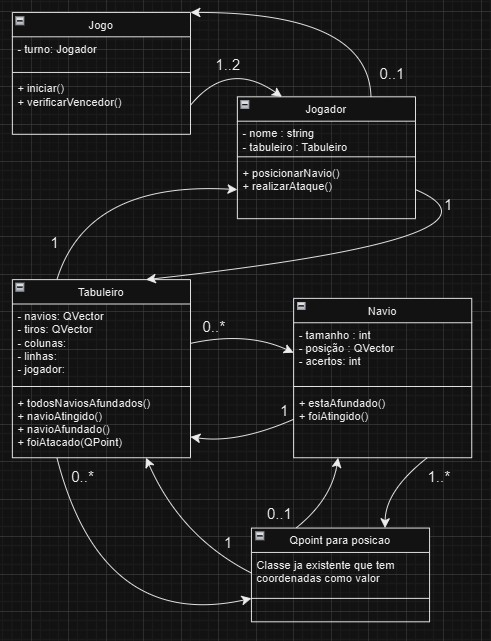

# Projeto orientado a objeto

## Classe Servidor
Responsabilidade: Gerenciar as conexões entre os dois jogadores e distribuir as jogadas entre eles.
### Atributos:
server: Um objeto de tipo QTcpServer que aguarda as conexões dos jogadores.
jogador1 e jogador2: São objetos de tipo QTcpSocket que representam os jogadores conectados ao servidor.
### Métodos:
novaConexao(): Estabelece as conexões dos jogadores.
lerDados(): Lê os dados de entrada e processa a jogada.
processarJogada(): Processa a jogada recebida e a envia ao outro jogador.

## Classe Cliente
Responsabilidade: Conectar-se ao servidor e enviar/receber dados sobre as jogadas.
### Atributos:
socket: Objeto QTcpSocket que conecta o cliente ao servidor.
### Métodos:
conectar(): Conecta o cliente ao servidor.
lerDados(): Recebe e processa dados do servidor.
dispararJogada(): Envia as jogadas ao servidor.

## Classe Tabuleiro
Responsabilidade: Representa o tabuleiro de um jogador, armazenando os navios e os tiros disparados.
### Atributos:
navios: Um vetor de objetos Navio, representando os navios no tabuleiro.
tiros: Um vetor de objetos Posicao, representando os locais onde os tiros foram disparados.
### Métodos:
adicionarNavio(): Adiciona um navio no tabuleiro.
disparar(): Processa o tiro disparado e verifica se atingiu um navio.
todosNaviosAfundados(): Verifica se todos os navios foram afundados.

## Classe Navio:
Responsabilidade: Representa um navio, com suas posições ocupadas e a verificação de acertos.
### Atributos:
tamanho: Número de células ocupadas pelo navio.
posicoes: Um vetor de objetos Posicao, representando as posições ocupadas pelo navio.
acertos: Contador dos acertos sofridos pelo navio.
### Métodos:
foiAtingido(): Verifica se o navio foi atingido em uma determinada posição.
estaAfundado(): Verifica se o navio está afundado (se o número de acertos for igual ao tamanho do navio).

## Classe Posicao:
Responsabilidade: Representa uma posição no tabuleiro (coordenada x, y).
### Atributos:
x e y: Coordenadas no tabuleiro.
### Métodos:
equals(): Verifica se duas posições são iguais.

## Observações:
- A classe Servidor tem uma relação de dependência com a classe Cliente através do uso de QTcpSocket para enviar e receber dados entre os jogadores.
- A classe Tabuleiro contém uma lista de objetos Navio, que representam os navios no tabuleiro.
- A classe Navio contém uma lista de objetos Posicao, que definem as coordenadas ocupadas pelo navio no tabuleiro.
- A classe Posicao é usada para definir as coordenadas de cada célula no tabuleiro.

[Retroceder](analise.md) | [Avançar](implementacao.md)

